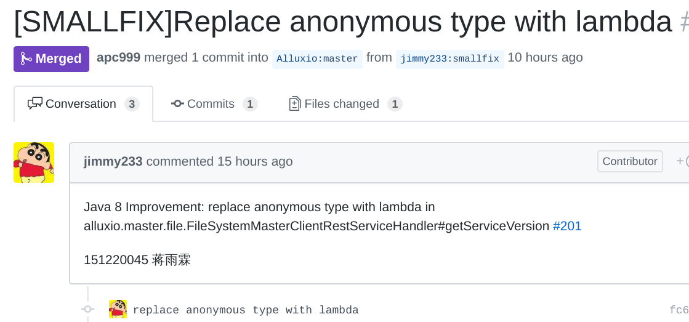
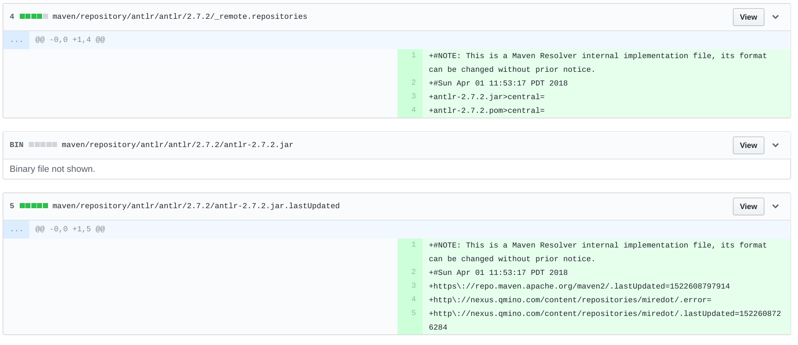

# 常见错误

## 1. commit 信息 或 pr 信息中含有学号、作业等信息

Alluxio 是 AMPLab 发起的流行开源项目，不是实验室的玩具项目。我们的目的在于指导大家如何向开源项目贡献代码，请不要在 commit 和 pr 中包含与项目无关的信息。另外，请不要使用中文。

例如：

## 2. 夹杂 IDE 自动生成的配置文件等无用文件

在大型项目中，开发人员众多，使用的 IDE 也不尽相同，把 IDE 的配置信息提交到代码库是不合适的，会引起冲突。

例如：

由于 ignore 文件无法随便修改，所以如果 IDE 自动生成的配置文件等没有被忽略，请重置 commit ，并手动选择改动进行提交。一般而言，涉及的改动没有文件的增删，所以直接用 `git commit -am '简要描述改动'` 提交改动即可。

## 3. 原 PR 出现问题后，关闭原有 PR，重新创建 PR
每个 PR 都会花费维护人员的精力，请尽量在原有的 PR 上修改代码（push 到相同的分支即可），这样维护者可以根据上下文快速的review，尽量避免发起一堆 PR 。
