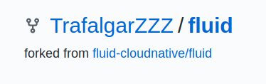
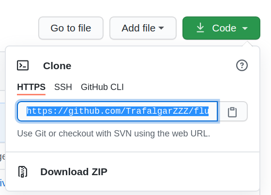
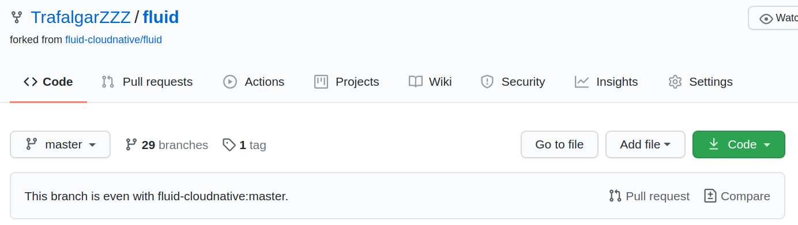
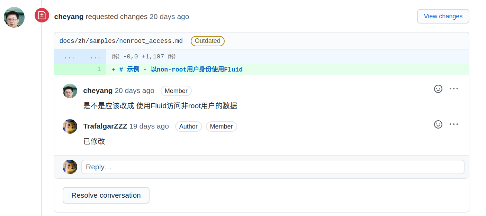
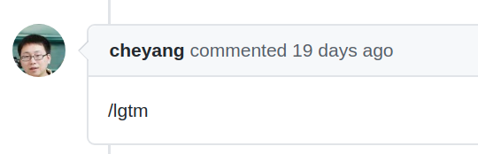

## Demo Task

## 贡献流程

> Notes: 对于接下来的项目的共享过程以非Collaborator的形式进行

### 环境搭建

1. 注册并登录Github账号

2. 找到Fluid项目的[Github页面](https://github.com/fluid-cloudnative/fluid)

3. 点击右上角的Fork，将该仓库Fork到自己的Github账号下：

    

4. git clone **自己账号下的项目**

    首先点击**自己账号下的项目页面**的Code，复制git repo url:

    

    接着在本机的某个目录下执行：
    ```
    cd <your-path>
    git clone <your-repo-url>
    ```

    例如：
    ```
    git clone https://github.com/TrafalgarZZZ/fluid.git
    ```
    
    clone成功后，该目录(i.e. <your-path>)下会出现一个名为fluid的目录

5. 设置git remote

    ```
    cd fluid
    ```
    首先查看git remote状态：
    ```
    git remote -v
    ```
    会得到如下结果：
    ```
    origin	https://github.com/TrafalgarZZZ/fluid.git (fetch)
    origin	https://github.com/TrafalgarZZZ/fluid.git (push)

    ```

    为了后续方便，我们手动创建一个Upstream Remote，其repo url为Fluid项目的地址：
    ```
    git remote add upstream https://github.com/fluid-cloudnative/fluid.git
    ```

    ```
    git remote -v
    origin	https://github.com/TrafalgarZZZ/fluid.git (fetch)
    origin	https://github.com/TrafalgarZZZ/fluid.git (push)
    upstream	https://github.com/fluid-cloudnative/fluid.git (fetch)
    upstream	https://github.com/fluid-cloudnative/fluid.git (push)

    ```

### 创建新Issue

1. 在[Fluid项目Issue子页面](https://github.com/fluid-cloudnative/fluid/issues)选择页面右边的"New Issue"

2. 选择“Document Defect”作为模板

3. 在Issue编辑页面，简单描述待解决的问题（例如：某文件License缺失或License不规范等），在模板的对应位置按照自己的Task填入信息

4. 提交Issue

### 本地修改

1. 创建新的本地分支
```
git checkout -b <new_branch_name>
``` 

【分支名字】例如：
```
git checkout -b remove_redundant_comment
```


2. 在该分支下对Fluid目录下的文件进行你想要做的修改，也就是Task内容

3. 完成后查看状态：
    ```
    git status
    ```

    得到类似如下结果：
    ```
    On branch remove_redundant_comment
    Changes not staged for commit:
     (use "git add <file>..." to update what will be committed)
     (use "git checkout -- <file>..." to discard changes in working directory)

        modified:   pkg/utils/kubectl/configmap.go

    no changes added to commit (use "git add" and/or "git commit -a")
    ```

4. commit本地修改
    ```
    git add pkg/utils/kubectl/configmap.go
    ```
    > Notes: 请确保你只add了自己改动的文件，commit前请确保你已经Review过自己的全部改动

    ```
    git status
    ```
    可以看到相关改动已经可以被commit了：
    ```
    On branch remove_redundant_comment
    Changes to be committed:
    (use "git reset HEAD <file>..." to unstage)

        modified:   pkg/utils/kubectl/configmap.go
    ```

    这时commit自己的修改：
    ```
    git commit -m <commmit-message>

    ```
    commit-message应当足够能描述该commit修改的内容，同时应当足够简单

    例如：
    ```
    git commit -m "remove redundant comment on `kubectl` function"
    ```

    你可以在`git log`中找到自己的commit history
    ```
    git log [--oneline] [--graph]
    ```

5. Rebase && Push
    【Rebase与Merge有着相似的功能，在Fluid项目里使用Rebase作为分支合并的主要方式】

    在完成全部改动，并将改动全部commit后，就可以将改动push到**自己的远程仓库**了

    由于同时可能有多个人同时并行地进行该项目的修改，因此为了防止合并冲突，强烈建议在Push前进行Rebase操作。

    Rebase操作会将寻找当前分支和另一个分支的最近公共祖先Commit，然后首先作用另一个分支的新Commits，接着作用当前分支的新Commits。简单来说，是一条分叉链表的合并操作，最终将会得到一条无分叉的commit链。

    在进行Rebase操作时，如果发生合并冲突，可以直接在本地分支上进行解决。

    步骤：
    
    首先，同步upstream仓库：
    ```
    git fetch upstream
    ```

    接着，以upstream的master分支为目标进行`git rebase`
    ```
    git rebase upstream/master
    ```

    若无冲突发生，即可进行接下来的Push操作：
    ```
    git push origin
    git push --set-upstream origin remove_redundant_comment
    ```
    上述命令将会提交到你自己的远程仓库，也就是名为origin的remote，这也是你拥有写权限的仓库。如果直接提交到`upstream` remote将会因为权限问题被拒绝

6. Pull Request

    

    点击Pull Request，在新页面中选择自己改动后的分支(e.g. remove_redundant_comment)

    **此时，你可以最后一次Review自己提交的commit，以及所做的改动**

    按照Pull Request模板进行填写，PR标题简述改动内容，PR中按照模板提示进行填写，在“Does this pull request fix one issue”的部分中，填写你刚才提交的Issue的编号，例如，提交的Issue编号为#123，那么此处写 Fixes #123，Github会将该PR自动链接到该Issue上，当该PR被合并到Master分支之后，对应的Issue也将自动关闭

    全部填写完成后，提交这个PR。

    【PR提交后的图片】

7. PR Review

    提交PR后，请持续关注自己PR的状态。
    Reviewer会对你的改动进行审核，讨论或提问，要求修改等
    请在相应的位置及时进行回复、或修改，如果你认为Reviewer给出的意见存在问题，也可在相应位置回复和Reviewer进行讨论。

    如果Reviewer认为你的改动存在问题，将会在相应的地方给出修改建议，并要求重新修改(Request Change):

    

    这意味着你需要重复2到4步，**大部分情况下无需rebase**，push到该PR对应的自己项目仓库下的分支上

    如果Reviewer认为你的改动没问题，那么通常会在该PR上留言：

    

    "lgtm"为 “Looks good to me"的简称，代表该PR可以被合并，

    在确定看到自己的PR状态从"Open"变为"Merged"后，恭喜你，正式完成了对于开源项目的贡献
