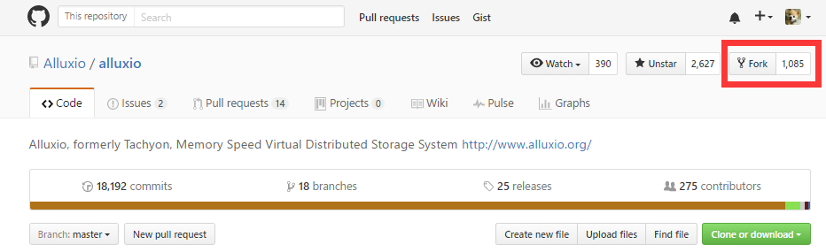
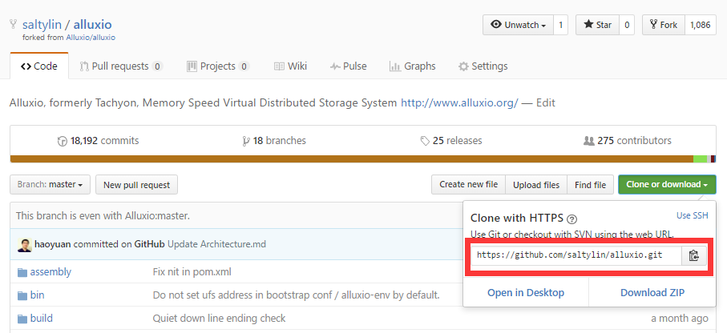
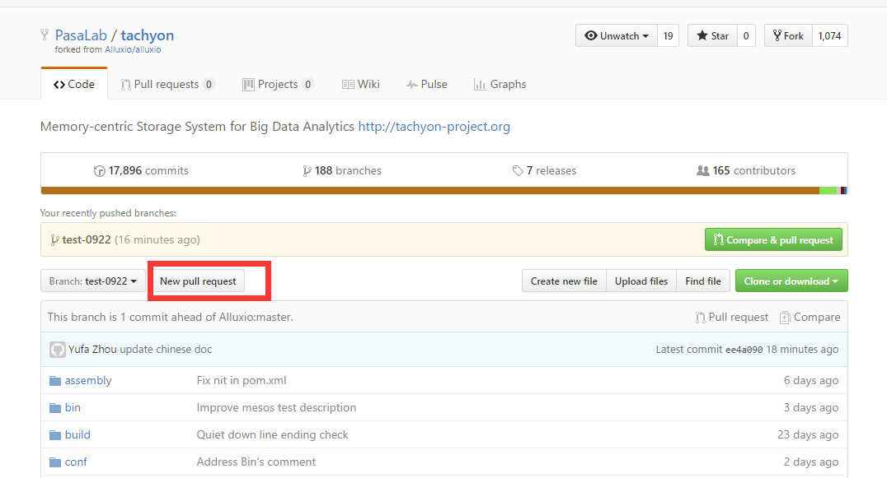
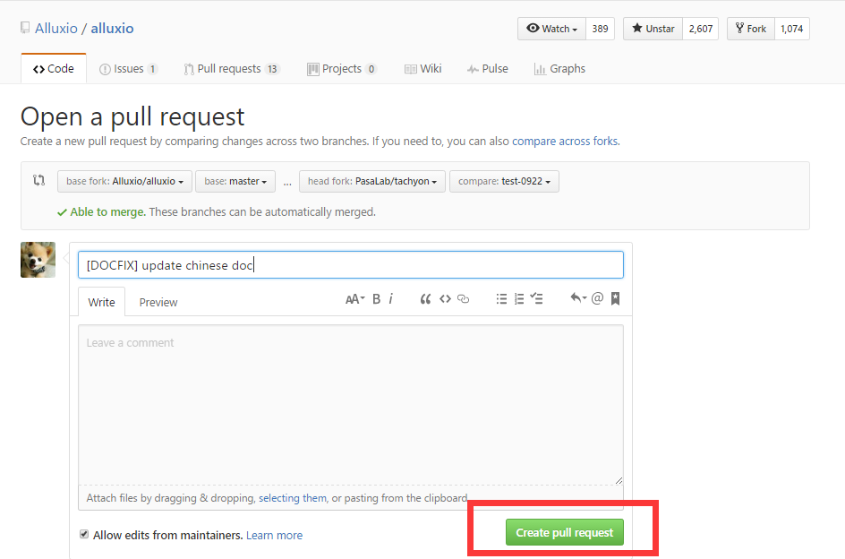
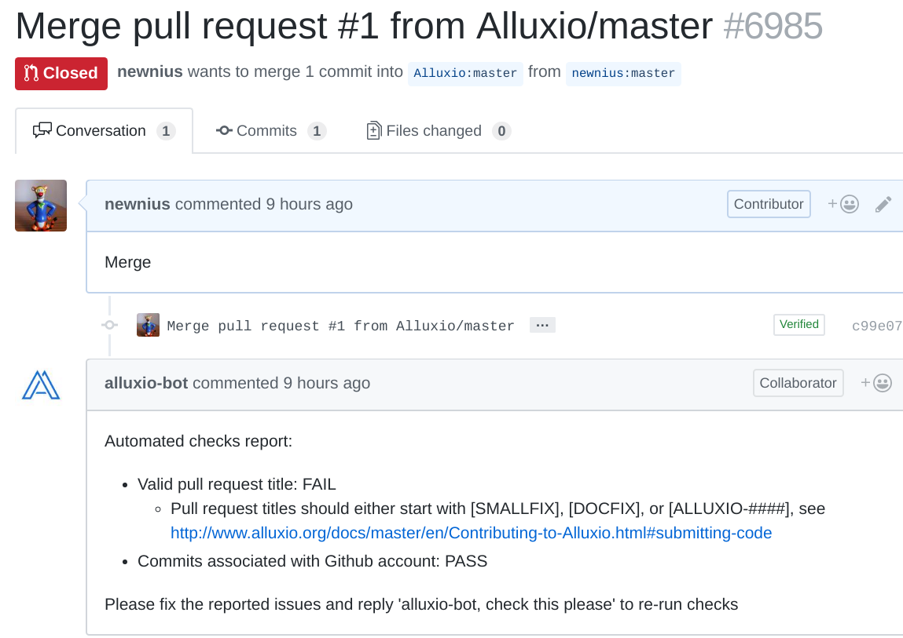
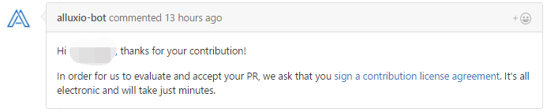

# Steps to create a PR (pull request)

## 1. Preparation

To finish this task, you have to install/setup `Java 8`, [`maven`](https://maven.apache.org/install.html) and [`git`](https://git-scm.com/book/en/v2/Getting-Started-Installing-Git)

## 2. Configure git

```bash
git config --global user.name "USERNAME“
git config --global user.email "EMAIL"
```

  - Replace `USERNAME` with your username in GitHub.com
  - Replace `EMAIL` with your email address in GitHub.com

## 3. Sign up in [GitHub](https://github.com/join) if you don't have one

## 4. Fork [Alluxio](https://github.com/Alluxio/alluxio) to your account



## 5. Clone Alluxio to your computer

```bash
git clone https://github.com/USERNAME/alluxio.git
```

*Replace `USERNAME` with your username in GitHub.com*




## 6. Create a new branch for modification

```bash
git checkout -b smallfix
```

and then update the code snippet mentioned in the guide

**Do not make changes directlly in the master branch**

## 7. Merge upstream in case the origin project changes

```bash
git remote add upstream https://github.com/Alluxio/alluxio.git

git fetch upstream

git merge upstream/master
```

## 8. Validating the code style etc.

```bash
mvn clean install
```

You shall see SUCCESS if all checks pass

## 9. Commit and Push your updates to repository online

```bash
git add . -A

git commit -m 'STATE WHAT YOU HAVE CHANGED BRIEFLY HERE'

git push origin smallfix
```

## 10. Make a pull request to Alluxio





**Notice: Your PR title must be started with [SMALLFIX], or you will get error msg like this**



## 11. Sign your code

The first time you contribute to Alluxio, you have to sign a contribution license agreement to agree your code being used under some license



When you create a pull request, a bot named `alluxio-bot` will ask you to sign the agreement, click the link provided and follow the guides to finish the agreement.

#### 12. Provide your Pull Request url to the teaching assistants

When your pull request is merged into the origin project, it means your changes are accepted.

Congratulations, you have been one contributor of [Alluxio](https://github.com/Alluxio/alluxio) !

Don't forget to send your PR url to the teaching assistants. The PR url looks like `https://github.com/Alluxio/alluxio/pull/6982`

**For more intormation, refer to [Contributor Getting Started](https://www.alluxio.org/docs/master/en/Contributing-Getting-Started.html)**
